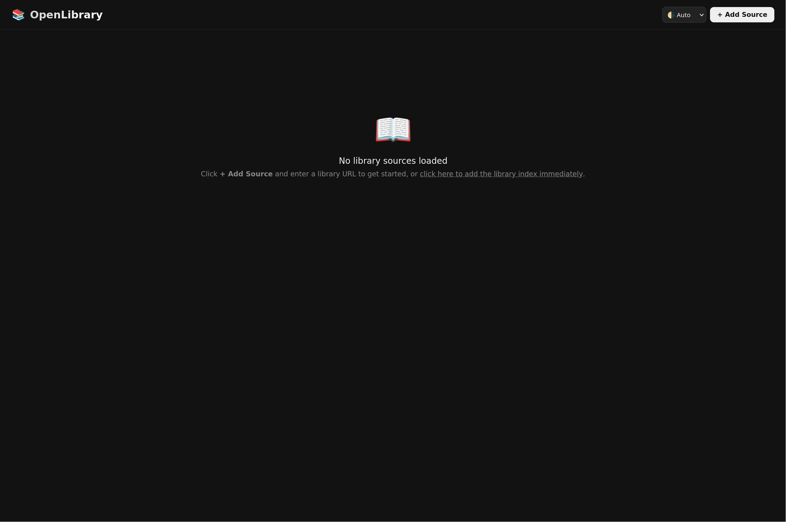
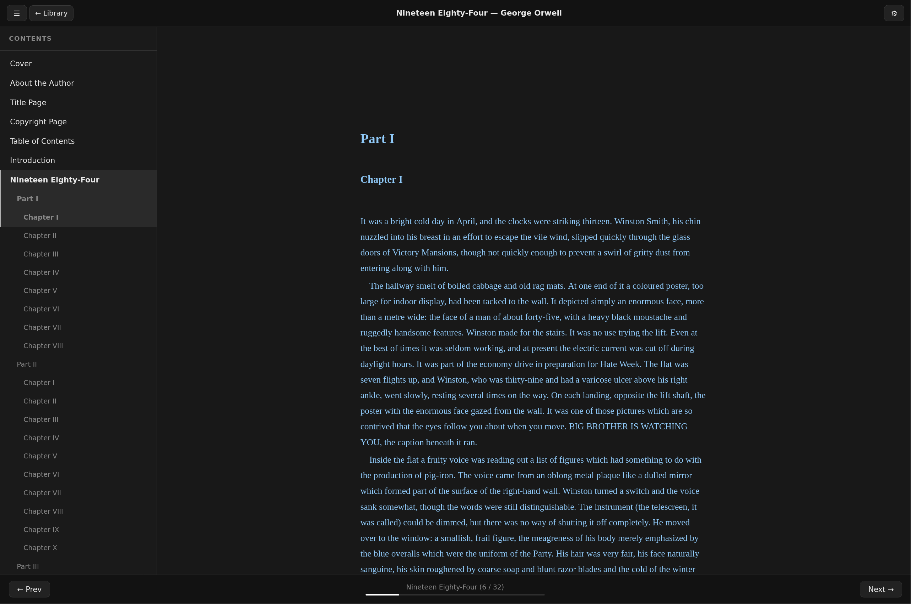

# OpenLibrary

### > **Want permanent access to this service?**: Simply clone this repository locally and open [index.html](./index.html) in your browser, no server needed!

A decentralised, encrypted ebook library system with no authentication, no usage limits, and no single point of failure.  
Books are served from ordinary file hosts (GitHub, any raw HTTP server). The web UI runs entirely in the browser — no backend, no tracking, no accounts.

> **📚 Public Libraries** — see [INDEX.md](INDEX.md) for a list of publicly available libraries you can add as sources right now.  
> **⚙️ Technical Deep-Dive** — see [TECHNICALS.md](TECHNICALS.md) for a detailed explanation of how everything works under the hood.

---

## Screenshots

### Library with Books Loaded


### Empty Library


### Built-in EPUB Reader


### Book Download Page


---

## Table of Contents

- [How it Works](#how-it-works)
- [Using the Web UI](#using-the-web-ui)
- [The In-Browser EPUB Reader](#the-in-browser-epub-reader)
- [The Library Format](#the-library-format)
  - [Repository Layout](#repository-layout)
  - [lib.json Structure](#libjson-structure)
  - [Encryption](#encryption)
- [Creating Your Own Library](#creating-your-own-library)
  - [Prerequisites](#prerequisites)
  - [Preparing Your Books](#preparing-your-books)
  - [Running the CLI](#running-the-cli)
  - [Hosting on GitHub](#hosting-on-github)
- [Contributing a Library to the Index](#contributing-a-library-to-the-index)
- [Running Locally](#running-locally)
- [Building a Portable Single-File Version](#building-a-portable-single-file-version)
- [Project Structure](#project-structure)
- [Technical Reference](#technical-reference)

---

## How it Works

OpenLibrary is split into two independent parts:

| Part | Purpose |
|------|---------|
| **`library` CLI** | A Go program that takes a folder of EPUB / MOBI / PDF files and produces an encrypted library ready to be pushed to any static file host. |
| **Web UI** (`index.html` + `css/` + `js/`) | A zero-dependency browser application that loads one or more libraries by URL, decrypts the index and file contents client-side using the Web Crypto API, and lets users browse and download books. |

Neither part ever communicates with a central server. The web UI fetches files directly from wherever you chose to host your library.

---

## Using the Web UI

1. **Open** `index.html` in any modern browser (or use the [local dev server](#running-locally)).
2. Click **📚 Sources** (top-right of the header) to open the Sources manager.
3. Click **+ Add New Source** and paste the base URL of a library.  
   See [INDEX.md](INDEX.md) for a list of known public libraries.
4. Click **Preview** to verify the library loads, then **Import**.
5. Browse the book grid, click any card to open the detail view, and click a download button to fetch and decrypt the file entirely in-browser — nothing is ever sent to a server.

> **Tip:** Your sources are encoded into the page URL after the `#`, so bookmarking or sharing the URL preserves your entire source list.

### Sources Panel Features

| Button | Action |
|--------|--------|
| **⎘ Copy as JSON** | Copies your full source list as a JSON array — handy for backing up or sharing a curated set of libraries. |
| **↑ Import JSON** | Pastes a JSON array of `{"url":"…","name":"…"}` objects to bulk-add sources. Duplicate URLs are skipped automatically. |
| **⎘ Copy** (per row) | Copies the URL of a single source to the clipboard. |
| **✕ Remove** (per row) | Removes a source from the current session. |

### Book Deduplication

If the same book (matched by **title + author + series**, case-insensitive) appears in more than one loaded library, the UI merges them into a single card. Download buttons in the detail view are labelled by both format and source name — e.g. `⬇ EPUB (Auchrio's Library) 1.4 MB` — so you can still choose which copy to download.
---

## The In-Browser EPUB Reader

OpenLibrary includes a full EPUB reader that runs entirely in the browser. No file is ever uploaded to a server; everything is decrypted and rendered locally.

### Opening a Book

- **From the library** — click any book card whose library has EPUB files, then click **Read Online** in the detail panel. The reader opens in a new tab.
- **Standalone** — navigate directly to `reader/index.html`. A drop zone is shown; drag-and-drop or click to choose any plain (unencrypted) `.epub` file from your device.

### Reader Features

| Feature | Detail |
|---------|--------|
| **Themes** | Auto (follows system), Light, Dark, Sepia |
| **Font size** | Small / Medium / Large / X-Large |
| **Font family** | Serif, Sans-serif, Monospace |
| **TOC sidebar** | Full table of contents parsed from EPUB3 nav.xhtml or EPUB2 NCX; collapses/expands with the ☰ button |
| **Chapter navigation** | ← Prev / Next → buttons; left/right arrow keys; swipe left/right on touch screens |
| **Scroll-to-turn** | Scrolling past the very bottom of a chapter advances to the next; scrolling above the top goes back to the previous (and lands at the bottom for continuity) |
| **Progress saving** | Last-read chapter is saved in `localStorage` keyed by book URL, so progress is restored on revisit |
| **Back to library** | The ← Library button returns to the exact library session (all sources loaded) that opened the reader |

### How the Reader Works (High Level)

1. The library passes the encrypted file URL, per-book decryption key, title, and library hash to the reader via a base64url-encoded JSON fragment in the URL hash.
2. The reader fetches the encrypted `.enc` file, decrypts it with AES-256-GCM using the per-book key, and obtains a raw EPUB zip.
3. The zip is parsed entirely in JS (no native APIs): EOCD → central directory → local file headers; DEFLATE decompression via `DecompressionStream('deflate-raw')`.
4. `META-INF/container.xml` → OPF path → spine order + manifest + TOC location.
5. Binary assets (images, fonts) become Blob URLs; CSS files are rewritten to replace all `url()` references with those Blob URLs.
6. Each chapter's XHTML is rewritten similarly, then injected into a sandboxed `<iframe>` via `srcdoc` with an injected `<style>` block applying the reader's theme and font settings.
7. Clicks inside the iframe are intercepted to handle in-book navigation and open external links in a new tab.

For a complete technical description see [TECHNICALS.md](TECHNICALS.md).
---

## The Library Format

### Repository Layout

A minimal library repository contains:

```
your-library/
├── lib.json          ← encrypted index + library metadata
├── <uuid>.enc        ← encrypted book file
├── <uuid>-cover.enc  ← encrypted cover image
└── ...               ← one pair per book (or more for multi-format books)
```

Everything can live flat in the root of the repository — no sub-folders are required.

### lib.json Structure

```json
{
  "name": "My Library",
  "encryption_type": 0,
  "links": {
    "Another Library": {
      "link": "https://raw.githubusercontent.com/someone/their-library/refs/heads/main",
      "key": 0
    }
  },
  "index": "<base64-encoded AES-256-GCM ciphertext of the book index>"
}
```

| Field | Description |
|-------|-------------|
| `name` | Display name shown in the web UI. |
| `encryption_type` | `0` = password is the literal string `"0"` (fully public). `1` = user must supply a custom key. |
| `links` | Optional map of named cross-library links. The web UI offers to import all linked libraries when you add this source. |
| `index` | Base64-encoded encrypted book index (see below). |

#### Decrypted Index Schema

Once decrypted, the index is a JSON object keyed by UUID:

```json
{
  "<uuid>": {
    "title": "The Name of the Wind",
    "author": "Patrick Rothfuss",
    "series": "The Kingkiller Chronicle",
    "series_index": 1.0,
    "formats": ["epub", "mobi", "pdf"],
    "source": {
      "epub": "<uuid>-epub.enc",
      "mobi": "<uuid>-mobi.enc",
      "pdf":  "<uuid>-pdf.enc"
    },
    "source_cover": "<uuid>-cover.enc",
    "source_key": "<64-character hex string>",
    "filesize": {
      "epub": 1245184,
      "mobi": 980123,
      "pdf":  2301440
    }
  }
}
```

For single-format books `source` may be a plain string and `filesize` may be a plain integer.

### Encryption

All encryption uses **AES-256-GCM** and is handled identically by the Go CLI and the browser Web Crypto API.

| What is encrypted | Key derivation | Wire format |
|-------------------|---------------|-------------|
| Index (`lib.json`) | PBKDF2-SHA256 · 100 000 iterations · 32-byte key · random 16-byte salt | `[Salt 16 B][Nonce 12 B][Ciphertext]` |
| Book files & covers | Raw 32-byte per-book key (stored in the decrypted index) | `[Nonce 12 B][Ciphertext]` |

* Each book has its own randomly-generated 256-bit encryption key.
* The index is encrypted with a PBKDF2-derived key from the library password (`"0"` for public libraries).
* Encryption prevents automated content scanning at the file-host level without requiring server-side authentication.

---

## Creating Your Own Library

### Prerequisites

* **Go 1.21 or later** — https://go.dev/dl
* This repository cloned locally:

```sh
git clone https://github.com/Auchrio/OpenLibrary
cd OpenLibrary
```

### Preparing Your Books

Collect your EPUB, MOBI, and/or PDF files into a single input folder. The CLI will automatically:

* Read the embedded title, author, series, and series index from EPUB/MOBI metadata.
* Detect when several format variants of the same book are present and combine them under one index entry.
* Extract and separately encrypt the cover image (EPUB preferred, MOBI as fallback).
* Assign a random UUID and a unique random 256-bit encryption key to each book.

Supported input formats: `epub`, `mobi`, `pdf`, `azw3`.

### Running the CLI

```sh
go run library.go <input-folder> <output-folder> [encryption-key]
```

| Argument | Required | Description |
|----------|----------|-------------|
| `input-folder` | ✓ | Path to the folder containing your raw book files. |
| `output-folder` | ✓ | Destination for `lib.json` and all `.enc` files. |
| `encryption-key` | — | Omit for a public library (`encryption_type 0`). Supply any passphrase for a password-protected library (`encryption_type 1`). |

**Example — build a public library:**

```sh
go run library.go ~/Books/Fantasy ~/my-library-output
```

This produces `~/my-library-output/lib.json` and one or more `.enc` files per book.

### Hosting on GitHub

1. Create a new **public** GitHub repository (e.g. `my-library`).
2. Copy the entire contents of your output folder into the repository root.
3. Commit and push to `main`.
4. Your library URL will be:
   ```
   https://raw.githubusercontent.com/<your-username>/my-library/refs/heads/main
   ```
5. Paste that URL into the OpenLibrary **+ Add New Source** dialog to verify it loads.

Any static file host works (GitHub Pages, Cloudflare R2, nginx, Caddy, etc.) — the URL just needs to resolve to the folder containing `lib.json`, and the host must send CORS headers (`Access-Control-Allow-Origin: *`). GitHub's raw CDN does this automatically.

---

## Contributing a Library to the Index

The community library index lives in [INDEX.md](INDEX.md).

### Steps

1. **Build and host** your library following the steps above.
2. Confirm it loads correctly in the web UI.
3. **Open a GitHub issue** with the title:
   ```
   [Library] Your Library Name
   ```
4. Include the following in the issue body:
   ```
   Name:        My Library
   URL:         https://raw.githubusercontent.com/your-username/your-repo/refs/heads/main
   Description: A brief description of what the library contains.
   Formats:     epub, mobi, pdf   (list whichever are present)
   Encryption:  0   (0 = public / no password, 1 = password required)
   ```
5. A maintainer will verify the library loads, review the content policy below, and add it to `INDEX.md`.

### Content Policy

Libraries added to the index must contain only works the contributor has the legal right to distribute — for example: public domain works, Creative Commons-licensed titles, works distributed with explicit author permission, or self-authored content.  
Maintainers reserve the right to decline or remove any listing at their discretion.

---

## Running Locally

Use the included `serve.py` script — it is identical to Python's built-in HTTP server but adds the `Access-Control-Allow-Origin: *` header that browsers require for cross-origin `fetch()` calls:

```sh
python3 serve.py          # serves on http://localhost:8080
python3 serve.py 9000     # optional: choose a different port
```

Open http://localhost:8080 in your browser.  
To test with a real library, add `http://localhost:8080/test` as a source (requires having run the CLI against the included test books first).

> **Why not `python3 -m http.server`?**  
> Python's built-in server does not send CORS headers. The browser will block every `fetch()` to a different origin (including `localhost` when the page is opened from a different port or from `file://`) with a *"CORS header 'Access-Control-Allow-Origin' missing"* error.

---

## Building a Portable Single-File Version

The development version loads CSS and JS from separate files. To produce a fully self-contained `index_combined.html` with zero external dependencies:

```sh
bash build_combined.sh
```

The resulting file inlines everything and can be opened directly from disk (`file://`) without any web server — ideal for offline distribution or archiving.

---

## Project Structure

```
OpenLibrary/
├── index.html            ← Web UI shell (references css/ and js/)
├── css/
│   └── style.css         ← All styles (dark/light themes, grid, modals, …)
├── js/
│   └── app.js            ← All application logic (crypto, rendering, state, …)
├── reader/
│   ├── index.html        ← EPUB reader shell
│   ├── css/
│   │   └── reader.css    ← Reader styles (themes, TOC sidebar, toolbar, nav bar)
│   └── js/
│       └── reader.js     ← Reader logic (ZIP parser, EPUB parser, blob URL rewriter, …)
├── build_combined.sh     ← Builds index_combined.html (portable single-file)
├── serve.py              ← CORS-enabled local dev server (replaces python3 -m http.server)
├── library.go            ← Go CLI for building encrypted libraries
├── go.mod                ← Go module (golang.org/x/crypto)
├── test/                 ← Example library generated from test EPUB files
│   ├── lib.json
│   └── *.enc
├── Overview.md           ← Original project specification
├── INDEX.md              ← Community library index
├── TECHNICALS.md         ← Technical deep-dive
└── README.md             ← This file
```

---

## Technical Reference

For the full technical deep-dive see **[TECHNICALS.md](TECHNICALS.md)**, which covers the ZIP parser, EPUB structure parsing, Blob URL rewriting, iframe sandboxing, CORS, and more.

### Web Crypto Parameters

```
Algorithm:   AES-256-GCM
Nonce:       12 bytes, randomly generated per file
Key size:    256 bits (32 bytes)

PBKDF2 (index encryption only):
  Hash:        SHA-256
  Iterations:  100 000
  Key length:  32 bytes
  Salt:        16 bytes, randomly generated per library build
```

### Supported Source URL Schemes

| Scheme | Example |
|--------|---------|
| GitHub raw CDN | `https://raw.githubusercontent.com/user/repo/refs/heads/main` |
| Any HTTPS with CORS | `https://yourdomain.com/libraries/my-library` |
| Local dev server | `http://localhost:8080/test` |

### Browser Requirements

The web UI requires a modern browser with support for:

* **Web Crypto API** (`crypto.subtle`) — AES-GCM decryption, PBKDF2
* **`DecompressionStream`** — EPUB cover extraction
* **`IntersectionObserver`** — lazy cover loading
* **ES2020+** — `async/await`, `??`, `?.`, `for…of Map`

Tested and working in: Chrome 80+, Firefox 113+, Safari 16.4+, Edge 80+.
